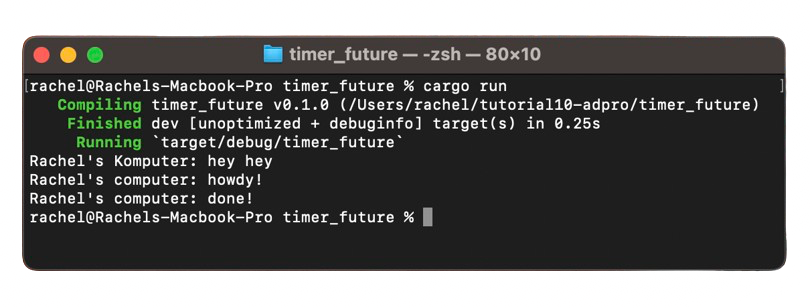
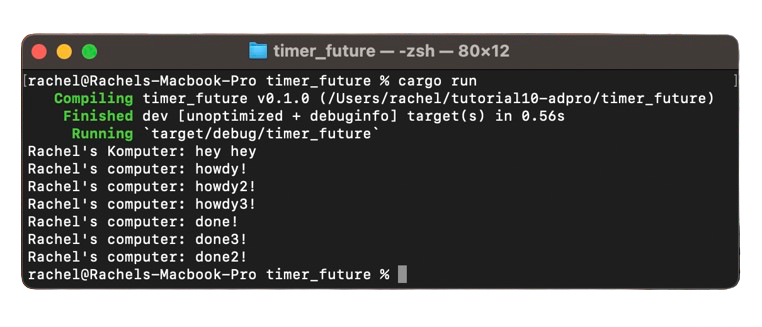
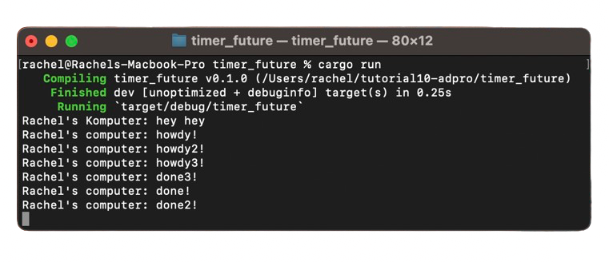

# Tutorial 10 - Timer Future
**Rachel Heningtyas Zanetta Erari - 2206081944 - A**

## 1.2 Understanding How It Works

From the output, we can see that the async function will operate outside of the main function that invokes it. Therefore, `hey hey` may appear as the output before `howdy!` and `done!` because `hey hey` is outside the async function. The function will continue with the program and execute `println!("hey hey");` while the async function is still waiting for the result from the future.

## 1.3 Multiple Spawn and removing drop
### Adding multiple spawn

The presence of many spawners in a system leads to an increased number of tasks being queued within the task sender, which functions like a message queue. This results in the program continuing to run indefinitely, as it assumes there will always be data being sent by a spawner. When a spawner invokes the spawn function, a new task is created and sent to the task sender. The executor then retrieves and executes each task sequentially until there are no more tasks left, and the spawner is dropped, indicating that the interaction is complete.

### `drop(spawner)` removed

It is crucial to perform `drop(spawner)` to signal that the use of the spawner is concluded. The spawner is similar to a message queue; spawning an item adds it to the queue. As the executor operates, it pulls messages from the queue. Dropping the spawner signifies that we have finished sending messages to the queue, allowing the executor to complete any remaining tasks and eventually terminate the program.

This setup explains why the string `done2!` appears after `done3!` in the output, despite their reverse order in the code. Since the tasks run concurrently, they do not wait for each other, and there is no guarantee they will complete in the same order as coded. This asynchronous behavior allows for simultaneous task execution without sequential dependencies.